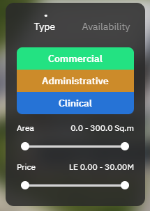

# Frontend Assignment

## Getting Started

1. **Fork this repository.**
2. **Install dependencies** and run the project locally.

## Task Overview

### 1. Polygon Filtering

Implement a feature that filters the visibility of SVG polygons based on their **status** and **price**, as shown in the example below:

- The polygons should be shown or hidden according to the filter criteria set by the user.
- The **status** and **price** data for each polygon can be found in the `/src/assets` directory.
- **Note**: The filter must be implemented using the **DOM API**.

### 2. Display Polygon Data on Hover

When a user hovers over a polygon, display the corresponding data for that unit. Refer to the example below for guidance:

